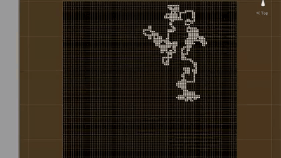

# Readme

This is a real-time-with-pause top down roguelike project I'm working on in Unity in my spare time. I've been working on the code base for a a little over twelve months, which is terrible since I've done so little on it, but in my defence I knew zero code when I started. 

After I finally migrated to Windows 10 I managed to break the original project, so had to re-code everything I'd already done and I'm still working on rewriting a lot of it, right now the world and mesh generation algorithms.

## Planned Features

- Menu
- Seeded World Generation
- Cellular Automata / Random Walk map generation iterating over 2D arrays
- Randomised Mesh generation at runtime for walls/floors/trees etc (Randomised in the sense that the meshes look less like they're on a grid, the cubes are a random rhomboid shape)
- Random item generation, i.e. dagger of special effect: can be thrown and has an effect on hit [freeze, bleed, teleport] etc
- Random Enemy generation, i.e. mage of flame, generates with fire resistance items and items that induce flame effects etc
- IK and Procedurally generated animations for entities
- Ragdolls
- Destructible meshes
- Pause -> Action -> Execute -> Pause; Action loop when in combat. The game pauses so you have time to make your next move, and unpauses while your character executes the action.
- I plan on writing a story for it eventually, but its not a priority

## Screenshots/Videos

Showcase of ShaderGraph Water effects, vignette, real time with pause gameplay loop, inventory system and more basic ui elements

Showcase of new procedural animation, screen shake, ui elements and ragdoll

Showcase of map/world/mesh generation in previous version

Showcase of procedural walking/sneaking/running animation in previous version

Showcase of first step in dungeon generation in previous version

